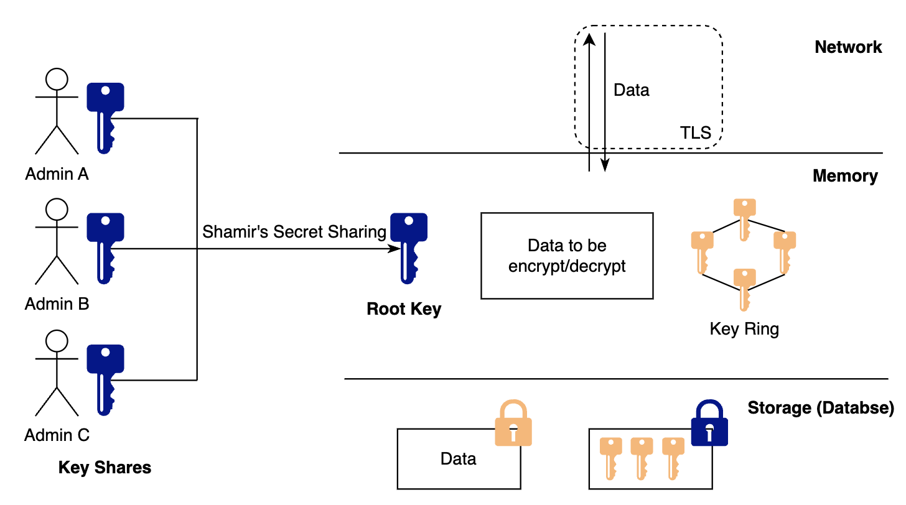
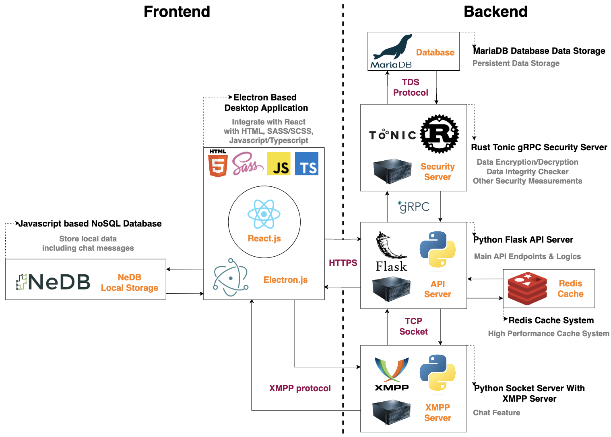

# CS-UY 4523 - Medihaven

## Leverage Security to Modern Electronic Medical Record (EMR) System

### Project Description

This project is made for CS-UY 4523 (Design Project)
The project is a desktop based EHR software application that eventually helps improve the efficiency of healthcare related working procedures within health facilities. The software aims to provide a robust security system to ensures sensitive data confidentiality under various attacking assumptions, while also provide a smooth user experience with better UI/UX design.

### Project Features

#### User facing Features

The software has three roles, Administrator, Physician and Receptionist. Each role has their own features, as detailed below:

1. Administrator:
    - Request a registeration token for new user to register into the system
    - Revoke the requested registration token
    - Chat with other two roles
2. Physician
    - Check personal calendar
    - Read patient's demographics, past medical records, precriptions, etc.
    - Record the medical information into clinical history
    - E-prescription
    - Chat with other two roles
3. Receptionist
    - Register new patient to the system
    - Make appintment for the patients and add to the physician's calendar
    - Chat with other two roles

#### Security Features

The main goal of the security aspect of the software is to provide high confidentiality for sensitive data like patient's information, medical records, etc, under various attacking assumptions.

Below is the list of assumptions and corresponding measures to mitigate/prevent the data leakage:

1.  Attacker might hack into the database, and read or modify the data directly in the database:
    -   All the sensitive data are encrypted by a well-designed crytography system (see below). All sensitive fields are encrypted using **ChaCha20Poly1305** with **Sequential Nonce**. The encryption key used for each row is randomly selected from a set of encryption keys. The encryption keys are stored inside of the database, but encrypted by a root key. The root key is distributed to several admins using **Shamir's Secret Sharing Algorithm**. All the encrypted data are dynamically decrypted inside of the Rust security server. Therefore, attackers will not be able to read any sensitive data even though they had a full control of the entire database.
    -   
    -   Some crucial database tables are protected by **Hash-then-Encrypt MAC scheme** with **SHA256** and **ChaCha20Poly1305**. Such measure prevent attacker from modifying database to perform some attacks. For example, without such Integrity measurement, attacker could possibility insert new admin account directly into the database, then login with the fake admin account on the frontend side and do various things. The integrity encryption key is stored together with data encryption key.
2.  Attacker might hack into the API server, and fake user requests to get the sensitive data:
    -   The software is employing a **public/private key based authentication model**, and all the requests to sensitive data should be digitally signed by the user's private key. The signature is checked within the security serve, so even though attackers attacked into the API server, they cannot make any fake requests to sensitive data as they do not have to private key of the corresponding users.
    -   Furthermore, replay attack is prevented by attaching a timestamp field to each signed requests. So each request will be invalidated by a very short period of time and attacker cannot replay the requests.
3.  Attacker might hijack a few number of administrator/physician/receptionist account
    -   Perfect data confidentiality is not possible in this case. But some actions are taken to mitigate the loss of sensitive data. Each account will be attached a rate limit mechanism, and each request for sensitive data will be counted into the rate limit system. And all the requests will be dropped when the rate reached its limit. Ideally, account access should be binded to the hosipital's attendance system, so that only personnel who checked today should be login into the system.s
4.  Attacker might try to hack into the Security server:
    -   If any attacker hacked into the security server, that would indeed be a problem. But luckily, we have several measurements to largely reduce the likelihood of such an event. Firstly, unlike the API server who is widely accepting connection from public, security server sits behind the API server, and only accepts communication with the API server, and the database. So it is already a hard problem for an attacker to be able to interact with the security server and exploit any unknown issues on it.
    -   Besides, the security server is built with Rust, whose ownership system and strict compile-time checks ensure memory safety and prevent common bugs like null pointer dereferencing, buffer overflows, and data races. So the likelihood of finding any dangerous bugs for the attacker to exploit is small.
    -   And finally, any attacker trying to steal the sensitive data like the encryption keys need to have at least root permission to be able to read the encryption keys from the memory. And further improvements could be applied to ensure the data safety in the memory with the help of **enclave**.

### Tech Stack

1. Frontend: Electron.js, React.js, SASS, NeDB
2. Backend: Flask, Rust Tonic, XMPP, Redis
3. Database: mariaDB
4. Testing: Pytest, Jest

   

### Project Hierarchy

-   **frontend/**: contains the main source code files for the frontend
    -   **src/**: contains the source code for the frontend implementation and tests
        -   **\_\_tests\_\_/**: contains the test scripts for the frontend renderer
        -   **main/**: contains the source code for electron.js
            -   **message_manager.test.js**: contains the test script for message manager of the frontend
            -   **main.ts**: contains the main window script for the frontend
            -   **key_manager.js**: contains the functions to manage key pairs
            -   **message_manager.js**: contains the functions to manage chat messages
            -   **tests/**: contains the test script for electron desktop features
        -   **renderer/**: contains the source code of the renderer written in Reactjs
-   **backend/**: contains the main source code files for the backend
    -   **api_server/**: contains the Flask API Server implementation
        -   **apis/**: contains main Restful HTTP API endpoint implementation
        -   **sql/**: contains database sql files
        -   **grpc_client/**: contains gRPC client implementation
    -   **sec_server/**: contains Rust Tonic gRPC Server implementation
        -   **proto/**: contains protocol buffer file. Soft-linked to the **backend/proto/** folder.
        -   **src/**: contains security server implementation
            -   **services/**: contains gRPC services implementation
    -   **xmpp_server/**: contains XMPP Server implementation
    -   **script/**: contains some automated bash script for some common tasks
    -   **tests/**: contains the test scripts for testing backend API
    -   **proto/**: contains the Protocol Buffer file that is used for inter-communication between API server and Security Server

### Contributions

1. ## Qianxi Chen (qc815@nyu.edu)
    - Helped with the development of the frontend
    - Helped with the development of the backend
    - Implemented the security system
2. ## Xiaoyi Yan (xy2089@nyu.edu)
    - Helped with the development of the backend
    - Helped with generating fake data for testing purpose
    - Helped with writing API tests
3. ## Xinyi Guo (xg2004@nyu.edu)
    - Helped with the development of the frontend
    - Helped with writing frontend tests
4. ## Emil Cheung (ec4016@nyu.edu)
    - Designed a full set of frontend on figma ([Links here](https://www.figma.com/file/8lEY1D7LEjtj5dMa1lF9Z3/medihaven-login))
    - Frequently consulted with the her nurse friend after each iteration of the software to ensure the software fits target user's demand
    - Helped with the development of the frontend
